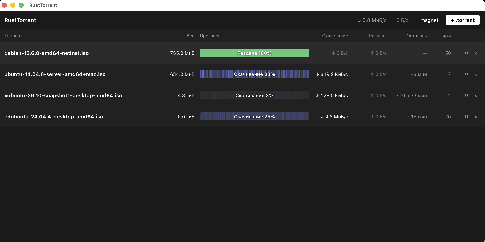
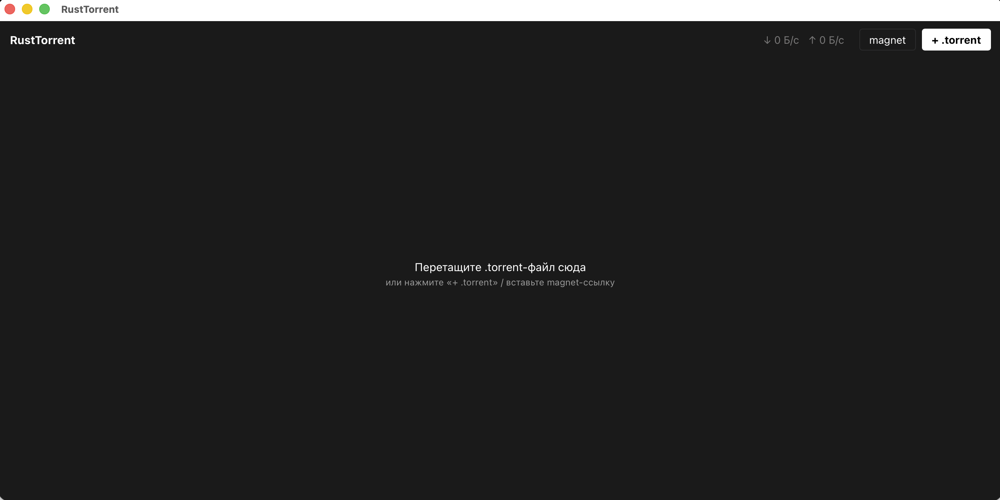

# RustTorrent

English · [Русский](README.md)

**A full-fledged BitTorrent client in Rust, built from scratch — from a bencode parser to its own GUI.**


It downloads **and seeds** torrents from `.torrent` files or magnet links: HTTP + UDP trackers,
Kademlia DHT, peer exchange, UPnP, 50-peer parallel downloading, a multi-torrent engine,
and a dark native UI on Tauri.

| Main window                                                                                                                                  | Empty state                                                                                                |
|----------------------------------------------------------------------------------------------------------------------------------------------|------------------------------------------------------------------------------------------------------------|
|  |  |

*The green row is a fully downloaded torrent being seeded; the blue stripes are the actual piece
distribution (Transmission-style bar) — holes for rare pieces are clearly visible. Speeds and ETA
are computed by the engine.*

## Features

- **Download and seed** — full lifecycle: recheck → download → seeding until shutdown
- **All peer sources**: HTTP/UDP trackers (BEP 3/15), the DHT swarm (BEP 5), ut_pex peer
  exchange (BEP 11)
- **Magnet links** — metadata is fetched from peers via ut_metadata (BEP 9) with fail-closed
  SHA-1 verification; works trackerless, over pure DHT
- **Multi-torrent engine** — one port per process, accept-router by info_hash, shared DHT client,
  in-place pause/resume without recheck, persisted torrent list and DHT routing table
- **Speed and swarm resilience**: rarest-first with random tie-break, 5-block pipeline, endgame
  mode, parallel recheck on all cores (rayon), round-robin choking with an optimistic slot,
  eviction of useless seeds from a full pool, UPnP port mapping with external-port announce
- **macOS UI**: Tauri v2 + Svelte 5, dark theme, torrent table, Transmission-style per-piece
  progress bar, drag-and-drop, magnet input, system notifications; closing the window keeps
  seeding in the background, Cmd+Q performs a clean teardown (`Stopped` announces, NAT unmap)

## Why it's interesting

- **The protocol is implemented by hand, not pulled from a library.** A custom bencode codec with
  strict canonical form, info-hash computed over the raw bytes of the `info` dict (never
  re-serialized), the 68-byte handshake, BEP 3 message framing, a full Kademlia responder,
  UDP announce with spec-compliant retries. The whole networking machine runs on tokio with an
  actor architecture (hub / peer tasks / disk-writer task); only cancel-safe `recv()` calls race
  inside `select!`.
- **Minimal dependencies.** No serde/serde_bencode/byteorder for the protocol; a workspace of
  11 crates with "one crate — one responsibility" boundaries; library crates contain no `unsafe`
  and no `unwrap`/`expect` (lint-enforced), typed errors via `thiserror`.
- **Engineering culture over "wrote it and forgot it"**: detailed unit tests for every error
  variant (input truncated at every suffix, garbage after valid data, DoS cases), integration
  tests with fake peers, live-swarm acceptance — plus a mandatory "do the tests actually catch
  bugs" check: deliberately breaking the code must fail tests.
- **Battle-tested**: Debian 13.6 netinst (755 MB) downloads both via `.torrent` through trackers
  and via magnet with zero trackers (pure DHT) — in both cases the SHA-256 matches the official
  checksum. In an isolated two-instance swarm the seeder serves the whole torrent, and the
  leecher's SHA-256 matches.

## About the project: human + AI agents

RustTorrent is an **educational project on working with AI agents**: all code was written in pair
with LLM agents (claude-code / pi), following a staged plan where the human acts as the architect
and reviewer.

The methodology:

1. **Every stage starts with a "grill" session** — an agent interviewer stress-tests the plan:
   design forks are pinned down as explicit decisions before the first line of code
2. **All decisions live in `AGENTS.md`** — a single shared context for the agents: architecture,
   constants, "don't change without discussion", and hard-won traps (bounded mpsc, cancel-safe
   select, one-shot bitfield, offset-66…)
3. **Machine-enforced Definition of Done** — clippy `-D warnings`, fmt, tests; code without tests
   equals code that doesn't exist; bug fixes start with a failing test
4. The result: 8 stages from a bencode parser to a GUI app — plus a documented decision history
   that lets agents (and humans) trace why the system is built the way it is

## Status

| Stage | What's done                                                                            |
|-------|----------------------------------------------------------------------------------------|
| ✅ 1  | Bencode codec, `.torrent` parsing, info-hash (SHA-1 over raw `info` dict bytes)        |
| ✅ 2  | HTTP announce, peer handshake, message framing                                         |
| ✅ 3  | Piece manager (rarest-first, endgame), disk layer, multi-peer download pipeline        |
| ✅ 4  | UDP trackers (BEP 15), seeding, choking, inbound connections                           |
| ✅ 5  | DHT (BEP 5), magnet links, extension protocol (BEP 10) + ut_metadata (BEP 9)           |
| ✅ 6  | ut_pex (BEP 11), UPnP port mapping, peer-wire polish                                   |
| ✅ 7  | Multi-torrent daemon: registry, accept-router, shared DHT, in-place pause, persistence |
| 🔶 8  | Tauri app (macOS): dark UI, torrent table, Transmission-style piece bar, notifications |

## Build & run

```bash
cargo build --release
cargo run --release -- <file.torrent | magnet:?> <download_dir> [port] [--no-seed]
cargo test                                             # offline tests
cargo test -p cli -- --ignored                         # manual smoke: real trackers, DHT, magnet

# UI app (macOS):
cd app && npm install && npm run tauri dev
```

Example magnet download (quotes are required — the URL contains `&`):

```bash
cargo run --release -- "magnet:?xt=urn:btih:<40-hex>&tr=<announce-url>" ~/Downloads
```

## How it's organized (cargo workspace)

| Crate          | Responsibility                                                                            |
|----------------|-------------------------------------------------------------------------------------------|
| `bencode`      | bencode codec: streaming decode, strict canonical form, depth limit                       |
| `metainfo`     | `.torrent` parsing (BEP 3 + BEP 12), magnet links, info-hash                              |
| `tracker`      | HTTP and UDP (BEP 15) announce: compact peers + dict-list fallback                        |
| `peer-wire`    | 68-byte handshake, BEP 3 framing (incl. Extended BEP 10), validated `Bitfield`            |
| `ext-pex`      | ut_pex (BEP 11): peer delta codec, 1000 cap, strict parser                                |
| `nat`          | UPnP IGD TCP port mapping (igd-next), blocking crate behind `spawn_blocking`              |
| `dht`          | Kademlia DHT (BEP 5): full k-buckets, iterative lookup, responder, `find_peers` → Stream  |
| `ext-metadata` | ut_metadata (BEP 9): metadata assembly with SHA-1 check, serving other peers              |
| `engine`       | session: download + seed + magnet phase; rarest-first, endgame, choking, mpsc actor       |
| `daemon`       | multi-torrent orchestrator: registry, accept-router by info_hash, shared DHT, UI statuses |
| `cli`          | end-to-end check: `.torrent` or magnet, download + seed until Ctrl+C                      |
| `app/`         | Tauri v2 UI (Svelte 5): torrent table, Transmission-style piece bar, dark theme           |

## License

MIT
